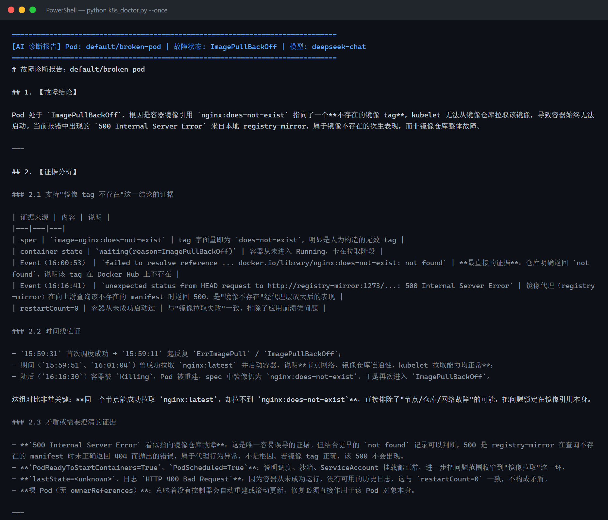
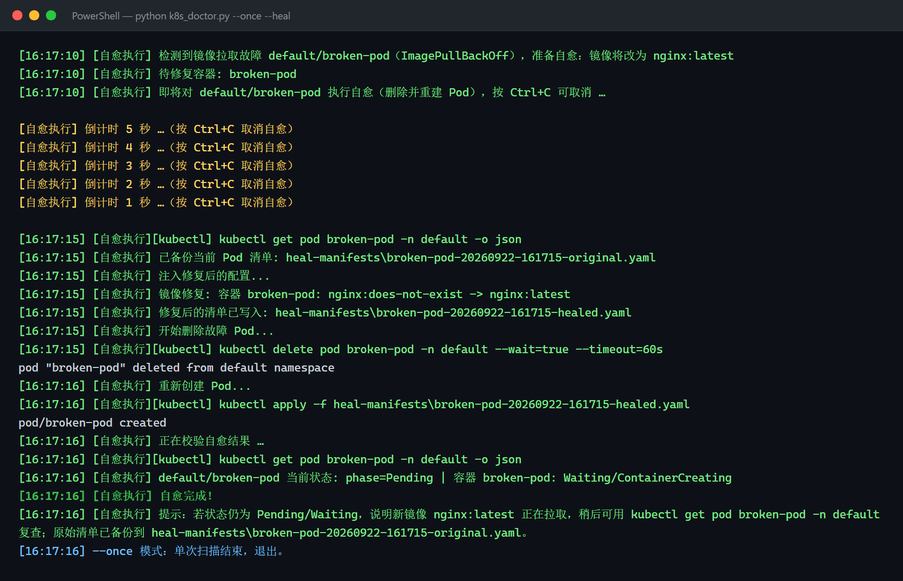
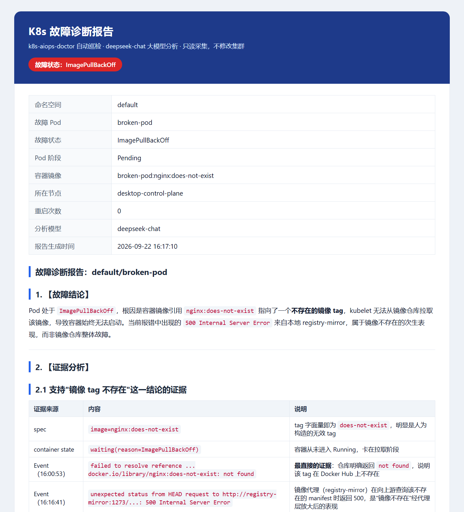

# K8s AIOps Doctor 🩺

[](https://github.com/Sherry1303/k8s-aiops-doctor/actions/workflows/ci.yml)

> 一个用 Python 写的 **Kubernetes 故障诊断 + 自愈机器人**：`watch` 监听 Pod 异常 → 采集上下文 → 大模型（DeepSeek）给出根因与修复建议 → 可选**自动自愈**（备份清单、换镜像、重建 Pod）→ 异步发送**排版精美的 HTML 邮件告警**。

默认 **100% 只读**，只有显式加 `--heal` 才会修改集群；即使开启自愈，也有 5 道安全闸门兜底。

---

## 📸 效果预览

> 以下三张均为**真实运行产物**：终端图由真实 stdout 日志渲染（内容未做改写，仅按视口裁切）；邮件图是程序自己生成的 HTML 报告截图（完整长报告见 `reports/*.html`）。

**① 终端：AI 根因分析报告**（`--once`，只读模式）



**② 终端：自愈执行全过程**（`--once --heal`，备份 → 换镜像 → 删除 → 重建 → 校验）



**③ 邮件告警：自动渲染的 HTML 报告**（截取报告开头，含结论与证据表）



---

## ✨ 项目亮点

| 能力 | 说明 |
|---|---|
| 🔍 实时监听 | 基于官方 `kubernetes` Python 客户端 `watch` 流式监听 Pod 变化，支持断线自动重连 |
| 🧠 AI 根因分析 | 上下文（status / conditions / 容器状态 / spec / Event / 日志）拼成提示词交给 `deepseek-chat`，输出「故障结论 + 证据分析 + 修复步骤 + 预防措施」的结构化报告 |
| 🛠 一键自愈 | `--heal` 对镜像拉取类故障执行 `备份 YAML → 注入修复镜像 → 删除故障 Pod → 重建 → 校验`，全过程打印中文日志 |
| 📧 邮件告警 | SMTP + `multipart/alternative`（纯文本 + HTML 双版本），Markdown 报告自动转成带样式的 HTML，**后台线程异步发送**，不阻塞监听主循环 |
| 🛡 默认安全 | 不加参数时只调用 `list / get / watch / read_namespaced_pod_log`，绝不写集群；自愈有多重白名单与限额 |
| 🧪 可演示 | 附带 `broken-pod.yaml` 故障注入样例，5 分钟即可复现「故障 → 诊断 → 自愈 → 恢复」完整闭环 |

---

## 🏗 工作流程

```text
  ┌─────────────────────────┐
  │ kubectl/kind 集群        │
  │ default 命名空间         │
  └───────────┬─────────────┘
              │ watch（流式）
              ▼
  ┌─────────────────────────┐   命中 ImagePullBackOff /
  │ 1. 故障检测              │   CrashLoopBackOff / Error …
  └───────────┬─────────────┘
              ▼
  ┌─────────────────────────┐
  │ 2. 上下文采集            │  Pod 详情 + Conditions + 容器状态
  │                         │  + Event(最多30条) + 容器日志(6000字符)
  └───────────┬─────────────┘
              ▼
  ┌─────────────────────────┐
  │ 3. 大模型分析 DeepSeek   │  失败原因 + 修复建议 + 预防措施
  └───────┬─────────┬───────┘
          │         │
          │         └──────────────────────────────┐
          ▼                                        ▼
  ┌───────────────────┐              ┌──────────────────────────┐
  │ 4a. 邮件告警(可选) │              │ 4b. 自愈执行(可选 --heal) │
  │  异步 SMTP HTML    │              │  备份→改镜像→删→重建→校验 │
  └───────────────────┘              └────────────┬─────────────┘
                                                  ▼
                                          Pod Running 1/1 ✅
```

---

## 📁 目录结构

```text
k8s-aiops-doctor/
├── k8s_doctor.py          # 主程序（诊断 + 自愈 + 邮件，单文件无第三方业务依赖）
├── broken-pod.yaml        # 故障注入样例：镜像 tag 故意写成不存在的 does-not-exist
├── diagnosis-report.md    # 一次真实运行的完整输出留档（演示效果）
├── requirements.txt       # 运行期依赖（kubernetes / openai / pyyaml）
├── requirements-dev.txt   # 开发与 CI 依赖（pytest，内部 -r requirements.txt）
├── pytest.ini             # pytest 配置（pythonpath=. / testpaths=tests）
├── tests/                 # 离线回归测试：不需要集群、不需要 API Key、不联网
├── .github/workflows/     # GitHub Actions：compileall + pytest + CLI 冒烟
├── README.md
├── LICENSE                # MIT 许可证
├── .env.example           # 环境变量样例（复制为 .env 后填自己的 Key）
├── .gitignore             # 忽略 .env / 运行期产物 / pytest 缓存
├── docs/images/           # README 里的效果预览截图
├── heal-manifests/        # 运行期产物：自愈时的原始/修复后 Pod 清单（不入库）
└── reports/               # 运行期产物：HTML 邮件报告（不入库，可浏览器预览）
```

---

## ✅ 测试与 CI

仓库自带一套**离线**回归测试：不需要集群、不需要 API Key、不联网，克隆下来就能跑。

```powershell
pip install -r requirements-dev.txt
python -m pytest -q          # 35 个用例，约 6 秒跑完
```

覆盖范围（`tests/test_k8s_doctor.py`）：

| 分组 | 覆盖内容 |
|---|---|
| 故障检测 | `ImagePullBackOff` / `CrashLoopBackOff` / Pod `Failed` 阶段识别、`--strict` 白名单、Pod 没有 `status` 等边界 |
| 告警冷却 | 故障指纹把 `ErrImagePull ↔ ImagePullBackOff` 归为一类、指纹不含 `restartCount`、冷却窗口内不重复分析 |
| 自愈安全闸门 | 不加 `--heal` 绝不碰集群、命名空间白名单、只处理镜像拉取类故障、控制器托管的 Pod 不代删、次数/冷却上限 |
| 自愈清单 | 镜像注入、剔除 `status` / `nodeName` / 服务端 metadata、不污染原始对象、只改目标容器 |
| 报告与邮件 | Markdown→HTML（表格/代码块/列表）、正文 HTML 转义、报告落盘命名、`--email-dry-run` 只落盘不发信、465=SSL / 587=STARTTLS |
| CLI 冒烟 | `--help` 退出码 0；没有集群时给中文提示 + 退出码 1（不抛 traceback）；默认参数必须是只读 |

CI（`.github/workflows/ci.yml`）在每次 push / PR 时依次执行 `python -m compileall` → `python -m pytest -q` → `python k8s_doctor.py --help`，
矩阵覆盖 **Python 3.9（ubuntu-24.04）/ 3.13 / 3.14 × Ubuntu + Windows**（Windows 也是本项目的开发环境，专门用来兜住控制台编码与路径问题）。

---

## 🚀 环境准备

**1. Python 3.9+**（开发环境实测 Python 3.14）

```powershell
python -V
pip install -r requirements.txt
```

**2. 一个可用的 K8s 集群 + kubectl**（本机用 kind 最省事）

```powershell
kind create cluster --name desktop        # 或 minikube start
kubectl get nodes                         # 确认 Ready
kubectl config current-context            # 脚本默认用当前 context
```

**3. DeepSeek API Key**（要用 AI 分析才需要；只做采集/自愈可跳过）

到 <https://platform.deepseek.com> 申请 Key。

---

## ⚙️ 配置

```powershell
# 大模型（AI 诊断必需）
$env:DEEPSEEK_API_KEY = "sk-xxxxxxxxxxxxxxxx"

# 邮件告警（可选；配了 SMTP_HOST 就会自动开启发信）
$env:SMTP_HOST     = "smtp.qq.com"
$env:SMTP_PORT     = "465"                 # 465=SSL，587=STARTTLS
$env:SMTP_USER     = "your@qq.com"
$env:SMTP_PASSWORD = "邮箱授权码"           # QQ 邮箱需在「设置→账号→IMAP/SMTP服务」生成授权码，不是登录密码
$env:MAIL_TO       = "your@qq.com"         # 可选，默认 3243743383@qq.com
```

> 也支持同名命令行参数（`--smtp-host` / `--mail-to` …），优先级：命令行 > 环境变量 > 默认值。

---

## 🏃 快速开始

```powershell
# ① 注入故障：镜像 tag 不存在，Pod 必然 ImagePullBackOff
kubectl apply -f broken-pod.yaml

# ② 只读诊断：采集上下文 + AI 根因分析（默认不会改集群）
python k8s_doctor.py --once

# ③ 离线自检：只采集不调用大模型（不需要 API Key）
python k8s_doctor.py --once --no-llm

# ④ 自愈 + 邮件告警：诊断后自动重建 Pod，并把 HTML 报告发到邮箱
python k8s_doctor.py --once --heal --email

# ⑤ 持续监听模式（Ctrl+C 退出）
python k8s_doctor.py
```

自愈效果：

```text
[16:00:54] [自愈执行] 检测到镜像拉取故障 default/broken-pod（ImagePullBackOff），准备自愈：镜像将改为 nginx:latest
[16:00:54] [自愈执行] 即将对 default/broken-pod 执行自愈（删除并重建 Pod），按 Ctrl+C 可取消 …

[自愈执行] 倒计时 5 秒 …（按 Ctrl+C 取消自愈）
 ...
[16:00:59] [自愈执行] 注入修复后的配置...
[16:00:59] [自愈执行] 镜像修复: 容器 broken-pod: nginx:does-not-exist -> nginx:latest
[16:00:59] [自愈执行] 开始删除故障 Pod...
pod "broken-pod" deleted from default namespace
[16:01:00] [自愈执行] 重新创建 Pod...
pod/broken-pod created
[16:01:00] [自愈执行] 正在校验自愈结果 …
[16:01:00] [自愈执行] 自愈完成！

# 结果
NAME         READY   STATUS    RESTARTS   AGE
broken-pod   1/1     Running   0          24s
```

---

## 📖 命令行参数

运行 `python k8s_doctor.py --help` 可查看全部参数，下面按用途分类。

### 通用 / 监听

| 参数 | 默认值 | 说明 |
|---|---|---|
| `-n`, `--namespace` | `default` | 要监听的命名空间（也可用 `K8S_NAMESPACE`） |
| `--model` | `deepseek-chat` | 大模型名称（也可用 `DEEPSEEK_MODEL`） |
| `--once` | 关 | 只扫描一次当前已有的 Pod，不做持续监听 |
| `--no-llm` | 关 | 只采集并打印上下文，不调用大模型（离线自检） |
| `--strict` | 关 | 只监控 `ImagePullBackOff / CrashLoopBackOff / Error` 三种状态 |
| `--cooldown` | `600` | 同一 Pod 同一故障的告警冷却时间（秒） |
| `--stream-timeout` | `300` | 单次 watch 连接的超时时间（秒） |
| `--retry-delay` | `5` | watch 断开后的重连等待时间（秒） |
| `--tail-lines` | `200` | 读取容器日志的最后 N 行 |
| `--max-log-chars` | `6000` | 每个容器日志最多提交给模型的字符数 |
| `--events-limit` | `30` | 每个 Pod 最多采集多少条 Event |

### 自愈（`--heal`，默认关闭）

| 参数 | 默认值 | 说明 |
|---|---|---|
| `--heal` | 关 | 开启自愈模式：对镜像拉取类故障执行「改镜像 → 删除 Pod → 重建 Pod」 |
| `--heal-image` | `nginx:latest` | 自愈时统一替换成的镜像（也可用 `HEAL_IMAGE`） |
| `--heal-namespace` | `default` | 允许执行自愈的命名空间白名单（逗号分隔，**安全限制**） |
| `--heal-countdown` | `5` | 自愈前的安全倒计时秒数（期间按 Ctrl+C 可取消） |
| `--heal-dir` | `heal-manifests` | 自愈清单（原始 / 修复后 YAML）落盘目录 |
| `--heal-max-attempts` | `2` | 同一 Pod 单次运行最多自愈几次（防死循环） |
| `--heal-cooldown` | `900` | 同一 Pod 两次自愈之间的最小间隔（秒） |

### 邮件告警

| 参数 | 默认值 | 说明 |
|---|---|---|
| `--email` | 关 | 生成报告后通过 SMTP 发送 HTML 邮件（配置了 `SMTP_HOST` 时会自动开启） |
| `--no-email` | 关 | 即使配置了 `SMTP_HOST` 也不发送邮件 |
| `--email-dry-run` | 关 | 只把 HTML 报告落盘、不真正发信（自检用，浏览器可直接预览邮件效果） |
| `--mail-to` | `3243743383@qq.com` | 收件人，多个用逗号分隔 |
| `--mail-from` | 取 `SMTP_USER` | 发件人地址 |
| `--smtp-host` / `--smtp-port` | `SMTP_HOST` / `SMTP_PORT` 或 `465` | SMTP 服务器与端口（465=SSL，587/25=STARTTLS） |
| `--smtp-user` / `--smtp-password` | `SMTP_USER` / `SMTP_PASSWORD` | SMTP 账号与授权码 |
| `--smtp-starttls` | 关 | 使用 STARTTLS 而不是 SSL |
| `--smtp-timeout` | `30` | SMTP 超时时间（秒） |
| `--report-dir` | `reports` | HTML 报告落盘目录（便于留档 / 预览） |

---

## 📧 邮件告警效果

`--email`（或 `--email-dry-run`）会在 `reports/` 下生成一份 HTML 报告，用浏览器打开即可预览邮件长相：

* 蓝色渐变标题头 + 故障状态徽章（如 `ImagePullBackOff`）
* 概览表：命名空间 / Pod 名称 / 故障状态 / 镜像 / 节点 / 重启次数 / 分析模型 / 生成时间
* 正文：大模型输出的 Markdown 报告自动转成 HTML（**标题 / 表格 / 代码块 / 列表 / 加粗** 都保留样式）
* 邮件为 `multipart/alternative` 双版本（纯文本 + HTML），中文主题自动做 RFC2047 编码，兼容各类邮箱客户端


不想发信只想看效果：

```powershell
python k8s_doctor.py --once --email --email-dry-run
start reports\*.html        # 用默认浏览器打开
```

---

## 🛡 安全设计

**默认只读**（不加 `--heal` 时）：只调用 `list / get / watch / read_namespaced_pod_log`，绝不调用 `create / patch / replace / delete`。

**开启 `--heal` 后的 5 道闸门：**

1. **命名空间白名单**：只处理 `--heal-namespace` 指定（默认仅 `default`）命名空间内的 Pod；
2. **故障类型白名单**：只处理镜像拉取类故障（`ImagePullBackOff` / `ErrImagePull` / `InvalidImageName` / `ImageInspectError`），业务逻辑错误不擅自处理；
3. **跳过控制器管理的 Pod**：带 `ownerReferences`（由 Deployment/StatefulSet 管理）的 Pod 只给建议、不代删——删了也会按原镜像重建，白删；
4. **人工可中止**：执行前打印 5 秒倒计时，按 `Ctrl+C` 即取消（会明确提示"集群未被修改"）；
5. **次数与冷却限制**：同一 Pod 最多自愈 `--heal-max-attempts`（默认 2）次，两次之间至少间隔 `--heal-cooldown`（默认 900s），杜绝"删-重建-再坏"死循环。

此外，原始 Pod 清单在删除前会完整备份到 `heal-manifests/*-original.yaml`，可随时用 `kubectl apply` 回滚。

---

## 🧪 故障注入与清理

```powershell
# 注入故障（镜像 tag 不存在 → ImagePullBackOff）
kubectl apply -f broken-pod.yaml
kubectl get pod broken-pod -w

# 看自愈前后差异
kubectl get pod broken-pod -o jsonpath='{.spec.containers[0].image}'

# 清理
kubectl delete -f broken-pod.yaml
Remove-Item heal-manifests\*, reports\* -Recurse -Force
```

---

## ❓ 常见问题

**Q：报错 `invalid api key` / `AuthenticationError`？**
没设置 `DEEPSEEK_API_KEY`。加 `--no-llm` 可跳过 AI 分析，只做采集与自愈。

**Q：Pod 重建了但还是 `ImagePullBackOff`？**
说明新镜像本身也拉不到（网络/镜像名）。用 `--heal-image` 换成本地能拉到的镜像，例如 kind 集群可先 `kind load docker-image nginx:latest`。

**Q：`kubectl delete` 之后 `apply` 报 `AlreadyExists`？**
Pod 名字释放有延迟。脚本已用 `--wait=true` 等待删除完成，若仍偶发，等 1~2 秒重跑即可。

**Q：为什么 `reports/` 和 `heal-manifests/` 没进 Git？**
它们是运行期产物（且包含本集群信息），已在 `.gitignore` 中排除，重新运行一次命令即可生成。

**Q：邮件没收到？**
确认用的是**邮箱授权码**而不是登录密码；QQ/163 需先在网页端开启 IMAP/SMTP 服务。用 `--email-dry-run` 先看 HTML 与日志中的 SMTP 报错。

---

## 🗺 后续规划

- [ ] 自愈成功后补发一封「已恢复」邮件（闭环通知）
- [ ] 支持 Deployment `rollout restart` 类自愈动作
- [ ] 更多告警通道：企业微信 / 飞书 / Slack Webhook
- [ ] 采集指标（`metrics-server`）做资源类故障判断

---

## ⚠️ 免责声明

本项目用于学习与自建集群排障演示。自愈功能会**真实删除并重建 Pod**，请先在测试集群验证，并严格使用 `--heal-namespace` 白名单限制范围，切勿直接用于生产环境的核心工作负载。

## 📄 License

MIT

